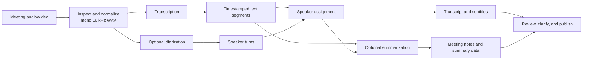

# Architecture

Meeting-notes is one processing pipeline with replaceable engines at its three
compute-heavy stages: transcription, speaker diarization, and summarization.
CPU implementations are the portable baseline. Accelerated implementations are
explicit opt-ins and do not silently fall back to CPU when their prerequisites
are unavailable.

## Processing flow

Normalization is shared by every ASR route. Qwen3-ASR adds forced alignment
inside transcription because its generated text does not otherwise contain the
timestamps required by speaker assignment and subtitles. Forced alignment is
not diarization: pyannote remains responsible for determining who spoke when.

## 1. Transcription

### Primary routes

| Configuration | Execution | Intended use | Requirements |
|---|---|---|---|
| `whisper_cpp` / `cpu` | Local whisper.cpp | Portable, slow baseline and default | Managed CPU runtime and local GGML model |
| `whisper_cpp` / `vulkan` | Local whisper.cpp Vulkan | Advanced local GPU route | Project-built Vulkan runtime and local model |
| `lemonade` / `npu` | Lemonade whisper.cpp NPU | AMD acceleration while leaving the GPU free | Running Lemonade Server and `whispercpp:npu` |
| `lemonade` / `vulkan` | Lemonade whisper.cpp Vulkan | Recommended accelerated Whisper route on the tested AMD system | Running Lemonade Server and `whispercpp:vulkan` |
| `qwen3_asr_lemonade` / `rocm` | Qwen3-ASR generation through Lemonade Vulkan, followed by a Python ROCm forced aligner | Alternative multilingual ASR behavior with timestamps | Lemonade Vulkan, AMD HIP, and the project-local ROCm alignment profile |

For Qwen, `runtime.device: rocm` describes the mandatory Python alignment side
of the combined route. Lemonade transcription itself is fixed to Vulkan. The
project does not offer a Lemonade ROCm transcription backend.

The Qwen route has no CPU mode. If either Vulkan generation or ROCm alignment is
unavailable, it fails with remediation rather than returning untimestamped text.

### Additional adapters

The registry also contains opt-in adapters for `openai_whisper`,
`faster_whisper`, and a Docker whisper.cpp wrapper. They are useful for custom
CPU or NVIDIA environments but are not the recommended AMD paths maintained by
the configuration wizard.

Language configuration is shared at `asr.language`, but each engine validates
its own supported set. `auto` is normally the best choice for recordings that
substantially mix languages. See the
[README language guidance](../README.md#language-configuration).

## 2. Speaker diarization

Speaker diarization uses `pyannote/speaker-diarization-community-1` and is
independent of the selected transcription model.

| Configuration | Execution | Notes |
|---|---|---|
| `device: cpu` | Full pyannote pipeline on CPU | Portable default |
| `device: rocm-hybrid` | Segmentation and clustering on CPU; speaker embeddings on the AMD GPU in FP32 | Explicit opt-in; no silent CPU fallback |
| `enabled: false` | Skip diarization | Transcript uses no inferred speaker identities |

Speaker counting is automatic by default. `max_speakers: null` does not impose
an eight-speaker ceiling. Known counts or bounds can be supplied in configuration
or for one `process` invocation.

Community-1 is gated. Initial setup therefore requires the user's Hugging Face
consent/login or a verified model backup. Both CPU and ROCm execution reuse the
project-local restored model. See the
[diarization setup guide](../README.md#speaker-diarization).

Qwen forced alignment and accelerated diarization can share one project-local
ROCm Python runtime. Provisioning records independent `qwen3_alignment` and
`diarization` profiles: diarization-only setup does not install Qwen's larger
Transformers dependency set, while adding Qwen upgrades the runtime to the
combined profile. Validation imports the requested entry points, not just their
package metadata. A small native-Windows compatibility layer supplies only the
optional distributed-module symbols that Transformers imports but single-GPU
inference does not use.

## 3. Summarization

| Backend family | Adapters | Output and trade-off |
|---|---|---|
| Provider-backed agent CLIs | `codex`, `claude`, `opencode`, `mimo` | Quality-oriented structured summaries; capability and data handling depend on the selected provider/model |
| Custom CLI | `local_command` | User-defined execution and protocol |
| Local Lemonade LLM | `lemonade` | Local/private when pointed at a local server; best-effort Markdown with reduced workflow features |
| Disabled | `summarization.enabled: false` | Transcript-only workflow |

Codex and Claude support the structured JSON used by decisions, action items,
clarification regeneration, and speaker-driven republishing. The Lemonade
adapter intentionally uses a smaller prompt and relaxed Markdown. It currently
does not support structured clarification regeneration or speaker-driven
republishing.

“Local” depends on the configured URL. A Lemonade server at `127.0.0.1` keeps
inference on the machine; pointing the adapter at a remote server changes that
privacy boundary. Provider-backed CLIs can transmit transcript content according
to their provider and account configuration.

## Failure and fallback semantics

CPU is a baseline choice, not a hidden recovery mechanism. `allow_fallback` is
false in the maintained profiles. If a user selects NPU, Vulkan, ROCm, or an
external summarizer and it is unavailable, the corresponding stage stops with an
actionable error. Returning to CPU is an explicit configuration change, which
keeps performance and provenance reproducible.

Completed transcription and diarization stages record backend, device, and model
identity in the job manifest; summarization records provider provenance. Timing
estimates use only compatible historical runtime identities so that a CPU result
is not presented as an estimate for Vulkan or NPU.

## Storage ownership

Meeting-notes-managed models, runtimes, diarization assets, and build logs live
under `project.cache_dir`, normally `./cache/`. Lemonade manages its own backend
and model storage outside that tree. The application reports large first-party
downloads before provisioning; Lemonade-owned usage must also be considered when
planning total disk space.

See [Performance](performance.md) for measured timings from the current AMD
validation machine and [the example configuration](../config/meeting-notes.example.yaml)
for the complete configuration schema in context.
